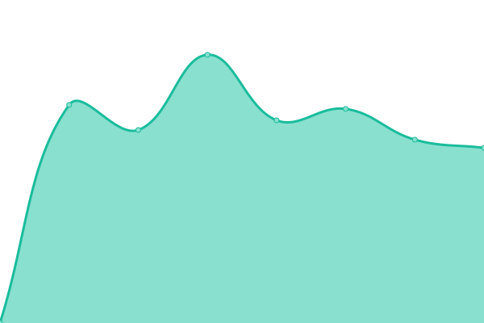
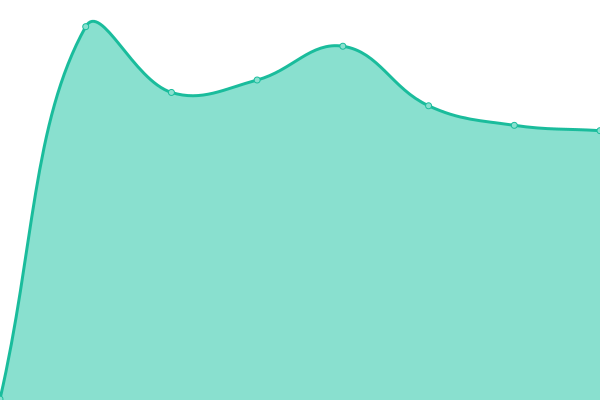

# [📈 Live Status](https://demo.upptime.js.org): <!--live status--> **🟧 Partial outage**

This repository contains the open-source uptime monitor and status page for [Moh Hasbi Assidiqi](http://mohhasbias.github.com), powered by [Upptime](https://github.com/upptime/upptime).

With [Upptime](https://upptime.js.org), you can get your own unlimited and free uptime monitor and status page, powered entirely by a GitHub repository. We use [Issues](https://github.com/mohhasbias/cw-conn-status-page/issues) as incident reports, [Actions](https://github.com/mohhasbias/cw-conn-status-page/actions) as uptime monitors, and [Pages](https://demo.upptime.js.org) for the status page.

<!--start: status pages-->
<!-- This summary is generated by Upptime (https://github.com/upptime/upptime) -->
<!-- Do not edit this manually, your changes will be overwritten -->
<!-- prettier-ignore -->
| URL | Status | History | Response Time | Uptime |
| --- | ------ | ------- | ------------- | ------ |
|  [Attachments Worker](https://cw-conn-heartbeat.vercel.app/api/only-attachments-beat) | 🟥 Down | [attachments-worker.yml](https://github.com/mohhasbias/cw-conn-status-page/commits/HEAD/history/attachments-worker.yml) | 

 1556ms
     
 | 

<a href="https://mohhasbias.github.io/cw-conn-status-page/history/attachments-worker">99.68%</a>
    

|  [Non Attachments Worker](https://cw-conn-heartbeat.vercel.app/api/skip-attachments-beat) | 🟥 Down | [non-attachments-worker.yml](https://github.com/mohhasbias/cw-conn-status-page/commits/HEAD/history/non-attachments-worker.yml) | 

 437ms
     
 | 

<a href="https://mohhasbias.github.io/cw-conn-status-page/history/non-attachments-worker">98.14%</a>
    

|  [Webhook](https://cw-conn-heartbeat.vercel.app/api/webhook-beat) | 🟥 Down | [webhook.yml](https://github.com/mohhasbias/cw-conn-status-page/commits/HEAD/history/webhook.yml) | 

 422ms
     
 | 

<a href="https://mohhasbias.github.io/cw-conn-status-page/history/webhook">99.50%</a>
    

|  [Chatwoot](https://dev-cw.hsi.id) | 🟩 Up | [chatwoot.yml](https://github.com/mohhasbias/cw-conn-status-page/commits/HEAD/history/chatwoot.yml) | 

 372ms
     
 | 

<a href="https://mohhasbias.github.io/cw-conn-status-page/history/chatwoot">100.00%</a>
    

|  [Notifikasi API](https://notifikasi.hsi.id/ping) | 🟩 Up | [notifikasi-api.yml](https://github.com/mohhasbias/cw-conn-status-page/commits/HEAD/history/notifikasi-api.yml) | 

 345ms
     
 | 

<a href="https://mohhasbias.github.io/cw-conn-status-page/history/notifikasi-api">100.00%</a>
    

|  [DBS API](https://dbs.hsi.id/SubGroupModuleAdmin/getAdminByGroupNip/test/test) | 🟩 Up | [dbs-api.yml](https://github.com/mohhasbias/cw-conn-status-page/commits/HEAD/history/dbs-api.yml) | 

 372ms
     
 | 

<a href="https://mohhasbias.github.io/cw-conn-status-page/history/dbs-api">100.00%</a>
    

|  [Kafka](https://cw-conn-heartbeat.vercel.app/api/kafka) | 🟥 Down | [kafka.yml](https://github.com/mohhasbias/cw-conn-status-page/commits/HEAD/history/kafka.yml) | 

 587ms
     
 | 

<a href="https://mohhasbias.github.io/cw-conn-status-page/history/kafka">99.58%</a>
    

<!--end: status pages-->

[**Visit our status website →**](https://demo.upptime.js.org)

## 📄 License

- Powered by: [Upptime](https://github.com/upptime/upptime)
- Code: [MIT](./LICENSE) © [Moh Hasbi Assidiqi](http://mohhasbias.github.com)
- Data in the `./history` directory: [Open Database License](https://opendatacommons.org/licenses/odbl/1-0/)
